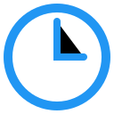

# Tab Timer

> "당신의 시간을 자동으로 기록하고, 더 나은 습관을 만듭니다."

## 프로젝트 개요

Tab Timer는 사용자의 웹 사용 습관을 개선하기 위해 개발된 Chrome 확장 프로그램 기반 시간 추적 시스템입니다.

### 주요 기능

- 웹사이트 접속 시 자동으로 체류 시간 추적
- 사용자가 설정한 시간 초과 시 알림
- 일간/주간 통계 시각화 (개발 중)
- 사용자별 목표 시간 설정 (개발 예정)

### 기술 스택

- **브라우저 확장**: JavaScript, Chrome API
- **UI 구성**: HTML/CSS, Material Icons
- **빌드 시스템**: pnpm, Vite
- **웹 대시보드**: GitHub Pages (정적 배포), React (예정)
- **앱**: Flutter (예정)
- **백엔드**: Firebase or Supabase (예정)

## 설치 방법

1. Chrome 웹 스토어에서 설치 (준비 중)
2. 또는 개발자 모드에서 로컬 설치:
   - `chrome://extensions/` 접속
   - 개발자 모드 활성화
   - "압축해제된 확장 프로그램을 로드합니다" 클릭
   - 프로젝트 폴더 선택

## 사용 방법

1. 확장 프로그램 아이콘 클릭
2. 시간 제한 설정 (선택사항)
3. 웹 서핑 시작 - 자동으로 시간이 추적됩니다
4. 설정한 시간 초과 시 알림 표시

## 개발 계획

### 2025 Q2 ~ Q3
- 일간/주간 통계 차트 구현
- 사용자별 목표 시간 설정 기능
- 데이터 정제 및 내보내기 기능

### 2025 Q3 ~ Q4
- Firebase 연동
- Flutter 기반 앱 베타 개발
- Android 앱 출시

### 2026 Q1
- iOS 앱 개발
- 프리미엄 기능 도입
  - 고급 분석
  - 집중 모드
  - 습관 개선 AI 리포트

## 기여하기

1. Fork the repository
2. Create your feature branch (`git checkout -b feature/AmazingFeature`)
3. Commit your changes (`git commit -m 'Add some AmazingFeature'`)
4. Push to the branch (`git push origin feature/AmazingFeature`)
5. Open a Pull Request

## 라이센스

이 프로젝트는 MIT 라이센스 하에 배포됩니다. 자세한 내용은 [LICENSE](LICENSE) 파일을 참조하세요.

## 연락처

프로젝트 팀장 - [@octxxiii](https://github.com/octxxiii)

프로젝트 링크: [https://github.com/octxxiii/tab-timer](https://github.com/octxxiii/tab-timer) 